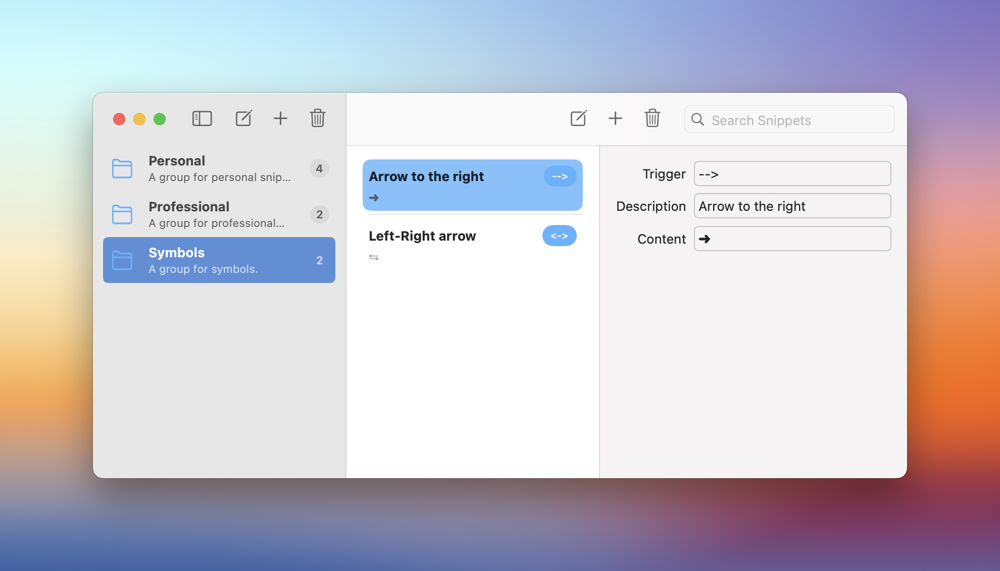

---
Shoofler's development is progressing slowly but surely. I have a UI prototype ready, and more importantly, basic keyword detection and snippet expansion are in place.

I've decided to use [The Composable Architecture](https://github.com/pointfreeco/swift-composable-architecture) (TCA) for this project. The decision was prompted by the fact that the new project I've started working on professionally at [Proton](https://proton.me) will use this framework built around the concept of [Unidirectional Data Flow](https://en.wikipedia.org/wiki/Unidirectional_data_flow). I will probably write about my experience with TCA in a later post.

