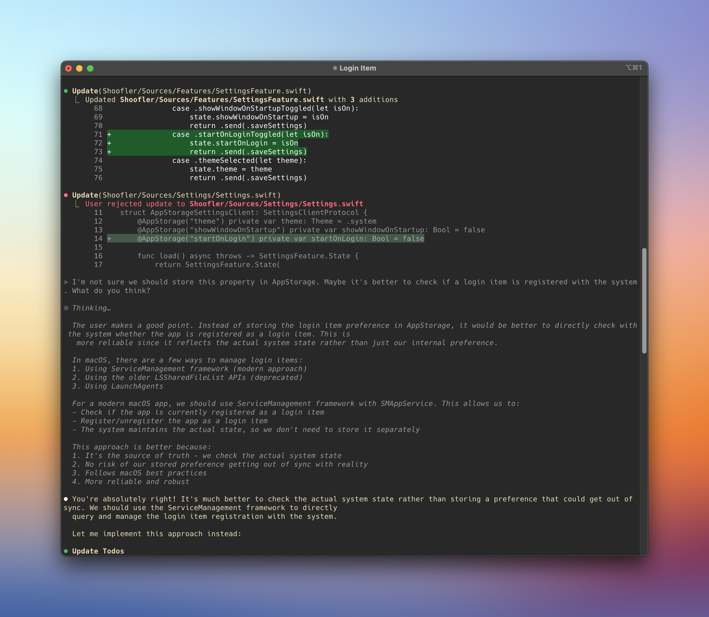

After attending a demonstration of Claude Code at my workplace, I have decided to test it myself by a relatively simple feature of Shoofler implemented by this command-line agentic tool.

Unlike traditional chatbots, Claude Code will have direct access to the project directory, will analyze it, generate a summary, and then be able to perform tasks through a command-line interactive interface. Claude Code can also compile the project and analyze any error and warning.

After spending $20 for the monthly Claude Pro subscription required to access to the tool, I proceeded to set it up, and asked it to implement Shoofler's automatic start when the user opens a session on their Mac. We're talking about a complete implementation including calls to the macOS API, as well as the graphical user interface in the Settings panel. I didn't choose this feature randomly. I knew it's relatively simple, but the method to implement it was recently modified by Apple.

The experience was a relative success, with some big caveats. First, the tool's ability to generate code and compile it is quite impressive. Modifications are made interactively. You describe what you want to achieve and Claude Code suggests one or more approaches, which you validate, refuse, or request modifications.

Claude Code immediately understood what I wanted to do, informed me that different methods existed to achieve the result, and indicated the most modern one. After a certain number of iterations and corrections, I obtained a first version of what I wanted, but it simply didn't work. The tool was able to correct the problem and in the end, I managed to get a functional feature.

But during the final review of the generated code, it appeared clearly that all these iterations had ultimately resulted in code of questionable quality: code repetition, over-complexity, etc... In the end, fixing the code took longer than generating it.

Would I have obtained a good result by simply asking questions to a chatbot as I've been doing in recent months? I think so. And that's probably the approach I'll continue to use in the near future. But if I have the knowledge and willingness to correct the generated output, what about the new generation of developers coming up? We might well find ourselves overwhelmed by 'vibe-coded' software of atrocious quality, virtually impossible to maintain.
